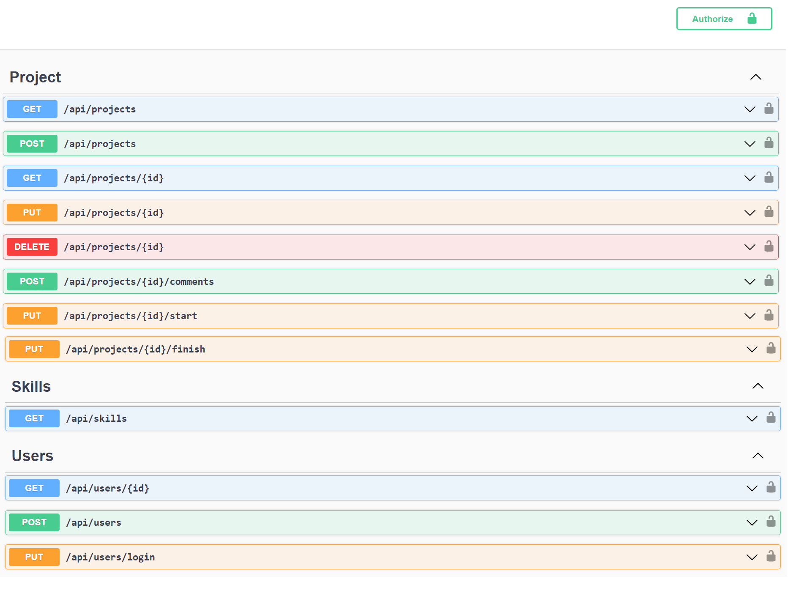

# DevFreela-
Arquitetura Limpa - CQRS - EF - Validação - Token JWT - Teste Unitário xUnit - Azure DevOps - Microsserviço e Mensageria - RabbitMQ
Formação ASP.NET Core

Curso completo de desenvolvimento de APIs com .NET 6
Arquitetura Limpa (Clean Architecture)
CQRS - MediatR
Entity Framework Core
Dapper
Validação de API com FluentValidation
Padrão Repository
Testes Unitários com xUnit - TDD
Autenticação e Autorização com JWT
Mensageria - RabbitMQ
MOQ
Azure Pipelines
Microsserviços

  

